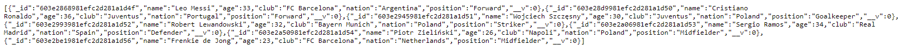
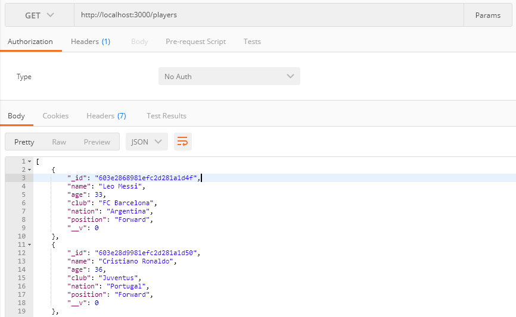
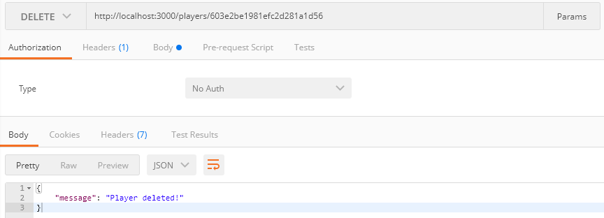

# Players Restful CRUD API
Built using Node.js, Express and MongoDB
## How to setup
In file database.config.js use your database!
Make sure that you are in your root folder of application.
1. Install necessary dependiences
```
npm install
```
2. Run server
```
node server.js
```
3. In your browser go to
```
http://localhost:3000
```
It is Welcome page
4. Then go to
```
http://localhost:3000/players
```
And you should see something like this

## Functionalities
It is a CRUD application, so you can create, update or delete a player at any time and get information about specific or all players<br />
For example you can do this in Postman<br />


Have fun!